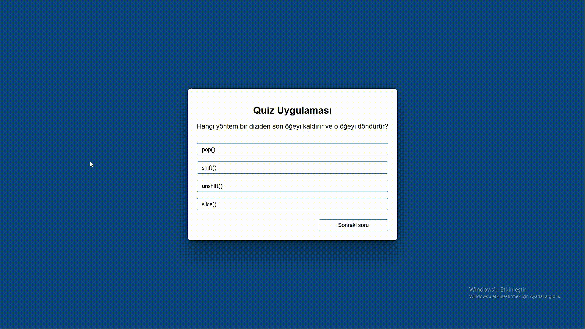

<h1>JavaScript Quiz Uygulaması</h1>

Bu proje, JavaScript kullanılarak oluşturulmuş basit bir quiz uygulamasıdır.
 
Kullanıcılar farklı konularda soruları cevaplayabilir ve sonuçlarını görüntüleyebilirler.

<h1>Kullanım</h1>

- JavaScript
- HTML
- CSS

<h1>Soruların ve Cevapların Eklenmesi</h1>

- Yeni soruları ve cevapları eklemek veya düzenlemek için `sorular.js` dosyasını düzenleyebilirsiniz.

